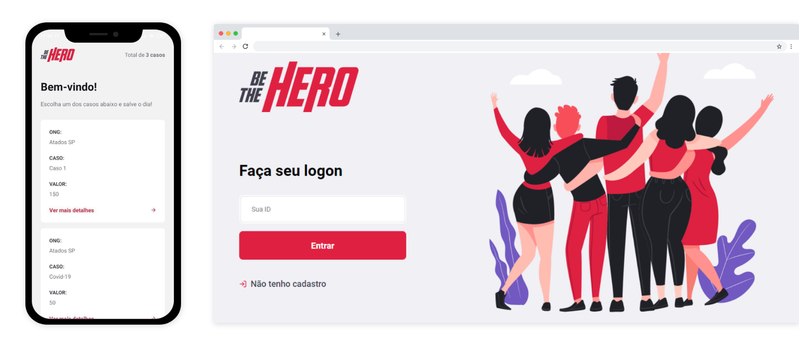

<div align="center">
  
  <p>Apoie ONGs, apoie as boas causas, <strong>be a hero!</strong><p>

[](https://app.netlify.com/sites/be-thehero/deploys) 


</div>



## 💡 Projeto

O projeto propõe o auxílio a organizações não governamentais em suas campanhas financeiras.
Você pode cadastrar sua ONG e seu(s) caso(s) e obter contato dos apoiadores.

## 🛠 Ferramentas

- [Node.js](https://nodejs.org/en/docs/)
- [React](https://reactjs.org/)
- [React Native](http://reactnative.dev/)
- [React Navigation](https://reactnavigation.org/)
- [Express](http://expressjs.com/)
- [Knex](http://knexjs.org/)
- [Jest](https://jestjs.io/)
- [Styled Components](https://styled-components.com/)

## 💻 Demo

[https://be-thehero.netlify.com/](https://be-thehero.netlify.com/)

### 📱 App

[Download para Android](https://github.com/jeferson-sb/be-the-hero/releases/tag/1.0.0)

## 🚀 Quick start

### Instalação

```bash
$ cd be-the-hero
$ cd frontend && yarn
```

```bash
$ cd .. && cd backend
$ yarn
```

### Utilização

```bash
$ cd frontend
$ yarn start
```

> Abra outro terminal na mesma pasta e rode

```bash
$ cd backend
$ npx knex migrate:latest
$ yarn dev
```

[Veja todos os endpoints](./backend/README.md)

## TODO

- [x] Criar release 1.0.0 do app
- [x] Adicionar Styled Components
- [x] Adicionar mais testes
- [ ] Adicionar autenticação JWT
- [ ] Exibir total de apoiadores(heroes)
- [ ] Exibir o progresso do arrecadado.

## 📝 Licença

Este projeto está sob a licença [MIT](https://github.com/jeferson-sb/be-the-hero/blob/master/LICENSE.md)

`Made with ❤ by Jeferson © 2020`
